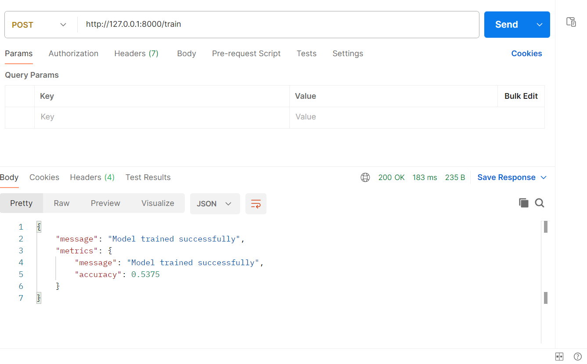

# Predictive Analysis API for Manufacturing Operations

## Overview
This project provides a RESTful API using FastAPI to predict machine downtime based on manufacturing data. The API allows users to upload a dataset, train a model, and make predictions.

## Features
- Upload CSV dataset containing machine operation data.
- Train a machine learning model (Random Forest,Logistic Regression,Decision Tree) to predict machine downtime.
- Make predictions by providing temperature and run-time values.
- Returns results in JSON format.

## Technologies Used
- **FastAPI** for API development
- **Scikit-learn** for machine learning
- **Pandas & NumPy** for data processing
- **Uvicorn** for running the API server

## Installation
1. **Clone the repository:**
   ```bash
   git clone https://github.com/codeprofile/assignment.git
   cd 1_assignment/app
   ```
2. **Create and activate a virtual environment:**
   ```bash
   python -m venv venv
   source venv/bin/activate  # On Windows use `venv\Scripts\activate`
   ```
3. **Install dependencies:**
   ```bash
   pip install -r requirements.txt
   ```

## Running the API
1. **Start the API server:**
   ```bash
   uvicorn main:app --reload
   ```
2. **Test API endpoints using Postman or cURL.**

## API Endpoints
### 1. Upload Data
- **Endpoint:** `POST /upload`
- **Description:** Uploads a CSV file containing manufacturing data.

  

### 2. Train Model
- **Endpoint:** `POST /train`
- **Description:** Trains the machine learning model and returns performance metrics.


### 3. Predict Downtime
- **Endpoint:** `POST /predict`
- **Description:** Predicts if the machine will experience downtime based on input data.


